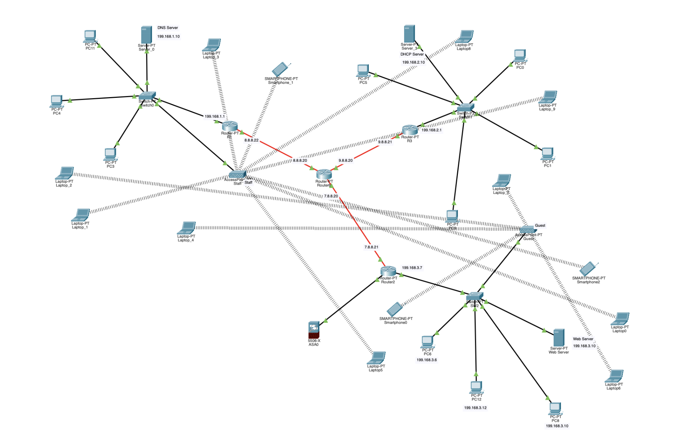

# 🌐 Enterprise Network Simulation – Cisco Packet Tracer

## 📦 Overview
This project simulates a complete simple **enterprise computer network** using **Cisco Packet Tracer** as part of the *IT Platforms* course (Winter 2024/2025).

It includes:
- 3 subnets with switches, routers, workstations, and mobile devices
- DNS, Web, and DHCP servers
- Class A addressing for WAN and Class C for LAN
- Wireless and wired access
- RIP-based dynamic routing
- Optical fiber links between routers

> 📁 `.pkt` simulation file and full technical report included  

---

## 🧠 Project Goals
- ✅ Design and build a multi-subnet enterprise network
- ✅ Configure DHCP, DNS, and Web servers
- ✅ Enable WAN–LAN communication using Class A & C IP addresses
- ✅ Implement dynamic routing with RIP
- ✅ Test connectivity, DNS resolution, and web access

---

## 🖥️ Network Features
- 🖧 **3 Subnets** connected via 4 routers
- 🌐 **WAN connection** via Router-PT R6
- 🧱 **Firewall (ASA0)** for subnet isolation and security
- 🛰️ **Access Points** for mobile & wireless devices
- 📡 **DHCP-enabled laptops, PCs, smartphones**
- 🔒 **WPA2 wireless encryption**
- ⚡ **Optical fiber** used between routers for fast internal routing

---

## 📂 File Contents

- `Simple_Enterprise_Network.pkt` – Network simulation file  
- `Enterprise_Network_Review.pdf` – Detailed documentation and topology diagrams
- Network_Topology.png
- README.md

---

## 📷 Example Topology Preview  

---

## 🧰 Technologies & Tools
- Cisco Packet Tracer  
- TCP/IP Networking  
- DHCP, DNS, Web Server Configuration  
- RIP Routing Protocol  
- Class A & Class C IP Addressing  
- Optical Fiber & Ethernet  
- Firewall Security (Cisco ASA)  
- Wireless Access (WPA2)
